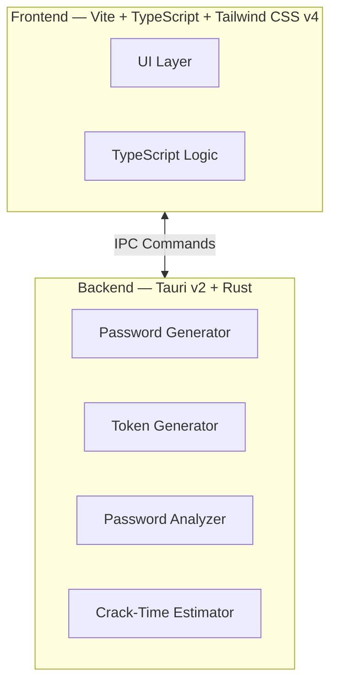

<div align="center">
  
  <h1>Madmax Pass</h1>
  <p>A fast, local-first password & token generator with cryptographically secure entropy.</p>

  <p>
    
    
    
    
    
    
  </p>
</div>

---

**Madmax Pass** is a desktop application built with [Tauri](https://tauri.app) that generates ultra-secure passwords and
random tokens entirely on your machine. All cryptographic operations are performed in Rust using the OS's secure random
number generator (`OsRng`). No network calls, no telemetry, no data leaves your device.

The app features a clean, minimal dashboard with three tools:

- **Password Generator** — Customizable length and character sets, with a quantum-safe mode.
- **Token Generator** — Cryptographically secure random tokens in multiple formats and sizes.
- **Password Analyzer** — Real-time strength analysis, entropy calculation, and crack-time estimates (classical &
  quantum).

---

## Features

|                              | Description                                                                                                        |
|------------------------------|--------------------------------------------------------------------------------------------------------------------|
| 🔒 **Local-Only**            | Zero network access. Everything happens on your machine.                                                           |
| ⚡ **Secure Randomness**      | Uses Rust's `OsRng` for cryptographically secure random number generation.                                         |
| 🧠 **Password Analysis**     | Real-time entropy calculation, character pool analysis, and classical vs. quantum crack-time estimates.            |
| 🛡️ **Quantum-Safe Mode**    | Enforces all character sets and a minimum length of 40 to resist quantum computing attacks (≥128 bits of entropy). |
| 🧹 **Memory Safe**           | Intermediate password buffers are securely zeroed from memory after use (`zeroize`).                               |
| 📋 **Clipboard Integration** | One-click copy to clipboard with visual feedback.                                                                  |
| 🌗 **Dark & Light Themes**   | Toggle between dark and light modes; preference is persisted locally.                                              |

---

## Architecture



- **Frontend**: Vanilla TypeScript with Vite and Tailwind CSS v4. No heavy framework — just fast, lightweight DOM
  manipulation.
- **Backend**: Rust-powered Tauri v2 application exposing three main commands via IPC.

---

## Security Model

| Concern                  | Implementation                                                                                                                                                      |
|--------------------------|---------------------------------------------------------------------------------------------------------------------------------------------------------------------|
| **Randomness Source**    | `rand::rng()` backed by `OsRng`, seeded from the operating system's CSPRNG.                                                                                         |
| **Uniform Distribution** | Rejection sampling ensures every selected character set is represented, followed by a cryptographically secure Fisher-Yates shuffle.                                |
| **Memory Hygiene**       | The `zeroize` crate securely clears intermediate password buffers from heap memory after generation.                                                                |
| **Length Enforcement**   | Hard limits between 4 and 4,096 characters.                                                                                                                         |
| **Quantum Resistance**   | A dedicated "Quantum Safe" mode enforces the full character pool (lowercase, uppercase, digits, symbols) and a minimum length of 40, yielding ≥128 bits of entropy. |

---

## Tech Stack

- **Desktop Framework**: [Tauri v2](https://tauri.app)
- **Backend Language**: Rust (edition 2024)
- **Frontend Build Tool**: [Vite](https://vitejs.dev)
- **Frontend Language**: TypeScript
- **Styling**: [Tailwind CSS v4](https://tailwindcss.com)
- **Package Manager**: [Bun](https://bun.sh)

### Key Rust Dependencies

| Crate     | Purpose                       |
|-----------|-------------------------------|
| `tauri`   | Desktop application framework |
| `rand`    | CSPRNG and secure shuffling   |
| `zeroize` | Secure memory wiping          |
| `base64`  | Token encoding                |

---

## Prerequisites

- [Bun](https://bun.sh/) (v1.0+)
- [Rust toolchain](https://rustup.rs/) (stable)
- [Tauri system dependencies](https://tauri.app/start/prerequisites/) for your OS

---

## Getting Started

### 1. Clone & Install

```bash
bun install
```

### 2. Development Modes

**Web UI only** (hot-reload, no Rust backend):

```bash
bun dev
```

**Full Tauri application** (Rust + Web UI):

```bash
bun tauri dev
```

### 3. Build for Production

```bash
bun tauri build
```

The compiled application will be available in `src-tauri/target/release/bundle/`.

---

## Testing & Benchmarks

### Rust Unit Tests

```bash
cd src-tauri
cargo test
```

### Benchmarks

```bash
cd src-tauri
cargo bench
```

The benchmark suite (`password_bench`) measures password generation throughput using Criterion.

---

## Password Generation Algorithm

1. **Validation**: Enforces length bounds (4–4096) and ensures at least one character category is selected.
2. **Pool Construction**: Builds a unified character pool from the selected categories (lowercase, uppercase, digits,
   symbols).
3. **Rejection Sampling**: Generates candidate passwords from the pool and validates that every selected category is
   represented. In practice, this converges in ~1 iteration for lengths ≥ 8.
4. **Secure Shuffling**: Applies a cryptographically secure Fisher-Yates shuffle to eliminate positional bias.
5. **Memory Zeroing**: The intermediate byte buffer is securely zeroed from heap memory before returning the final
   `String`.

---

## License

MIT

---

<div align="center">
  <em>Generate and analyze secure credentials with confidence.</em>
</div>
