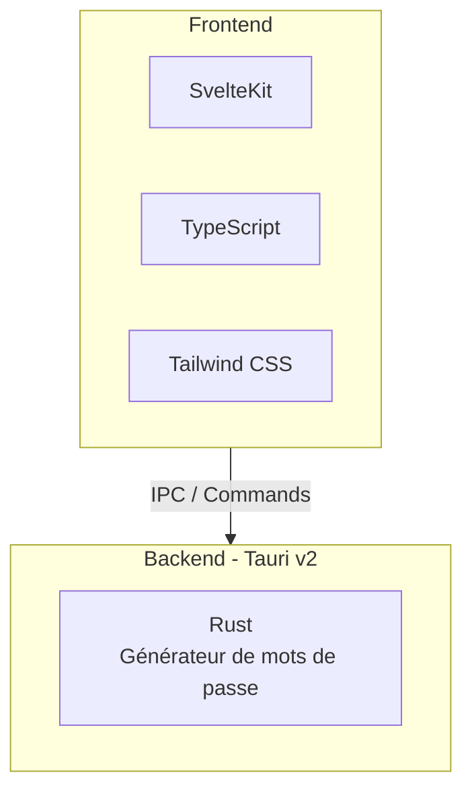

<div align="center">
  
  <h1>Madmax Pass</h1>
  <p>Interface moderne de génération de mots de passe ultra sécurisés.</p>

  <p>
    
    
    
    
    
    
  </p>
</div>

---

Madmax Pass est une application Tauri qui génère des mots de passe ultra-sécurisés en local, avec une génération
effectuée en Rust pour la vitesse et la sécurité. L'interface est un tableau de bord simple avec une barre latérale et
un panneau de génération de mots de passe minimaliste.

## Fonctionnalités

| Feature | Description                                               |
|---------|-----------------------------------------------------------|
| 🔒      | Génération locale uniquement (aucun appel réseau)         |
| ⚡       | Randomité cryptographiquement sécurisée (`OsRng` de Rust) |
| 📏      | Contraintes de longueur : minimum 16, maximum 4096        |
| 📋      | Interface simple avec copie vers le presse-papiers        |

## Stack Technique



- **Frontend** : SvelteKit + TypeScript + Tailwind CSS v4
- **Backend** : Tauri v2 + Rust (génération de mots de passe)

## Prérequis

- [Bun](https://bun.sh/)
- [Rust toolchain](https://rustup.rs/) (stable)
- [Prérequis Tauri](https://tauri.app/start/prerequisites/) pour votre OS

## Installation & Utilisation

### Installation des dépendances

```bash
bun install
```

### Mode Développement

**UI Web uniquement :**
```bash
bun dev
```

**Application Tauri complète :**
```bash
bun tauri dev
```

### Build Release

```bash
bun tauri build
```

## Tests

**Tests unitaires Rust :**
```bash
cd src-tauri
cargo test
```

## Génération de Mots de Passe

- Implémenté en Rust dans `src-tauri/src/password.rs`
- Force les limites min/max (16–4096)
- Garantit au moins une minuscule, une majuscule, un chiffre et un symbole

## Structure du Projet

```
madmax-pass/
├── src/                      # Frontend Svelte
│   ├── main.ts              # Logique frontend
│   └── styles.css           # Styles Tailwind
├── src-tauri/               # Backend Rust
│   ├── src/
│   │   ├── lib.rs           # Configuration Tauri
│   │   └── password.rs      # Générateur de mots de passe
│   └── icons/               # Icônes de l'application
└── index.html               # Layout UI
```

---

<div align="center">
  <em>Générez des mots de passe sécurisés en toute simplicité.</em>
</div>
